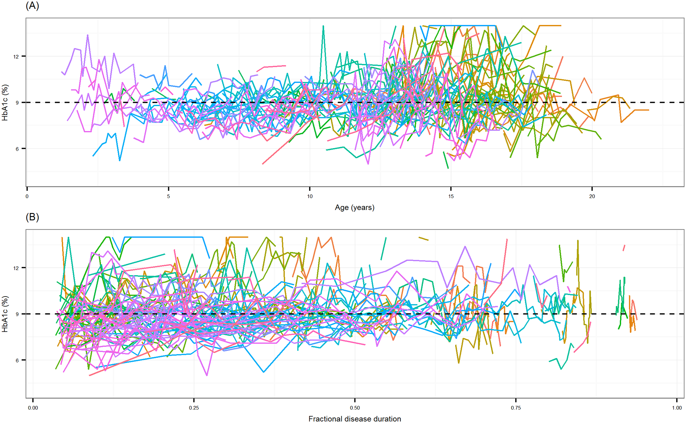

# Homework 6 - Haoming Yang (hy1528)
----------------------------------------------------------------------------------------------------------------------------
## Assignment1:Review Comment
### I make my comment for yunhecui(yc3420) HW4 Citibike assignment
#### 1. The Null and Alternative hypothesis are formulated correctly in both words and formular. It would be better to put ‘avgtime'in the subscript like this
H0 : Wavgtime <= Mavgtime
#### and denote that 'W' stands for women, 'M' stands for men. and 'avgtime' stands for average time of riding during the weekdays

#### 2. The data supports the project: it has the appropriate variables to answer the question, and was properly pre-processed to extract the needed columns.
#### A possible processing of the data would be extract men and women data from the gender columns, which will prepare for the further statistical testing.

#### 3. As for the test for this quesiton, since the question is do difference exist between mean women tripduration and mean men tripduration and it has two samples data(men's tripduraton data and women's tripudration data) and we don't know the population variance. Therefore, t-test can be applied here because it could use the sample variance to caculate.

#### 4.The figure gives us a very interesting observation. A validation using other months or years data to test the same question can be considered. Is there a seasonal pattern? or is this parttern only hold for some months or the hold year.

## Assignment 2: Literature choices of statistical tests as well as for the Readme.md

I cooperate with Jianwei Li and Wenjie Zheng in this part. Please see our work below.

----------------------------------------------------------------------------------------------------------------------------
 

| **Statistical Analyses**	|  **IV(s)**  |  **IV type(s)** |  **DV(s)**  |  **DV type(s)**  |  **Control Var** | **Control Var type**  | **Question to be answered** | **_H0_** | **alpha** | **link to paper**| 
|:----------:|:----------|:------------|:-------------|:-------------|:------------|:------------- |:------------------|:----:|:-------:|:-------|
ANOVA	| 1, Weight 2, Height 3, Relative Age 4, Shooting 5, Sprint(20m) 6, Agility 7, Dribbling 8, Ball Control  | quantitative | 1, Speed Ability Rating 2, Technical Ability Rating| quantitative | N/A | N/A | 	Are the 8 independent variables(factors) listed above significant enough to demonstrate adequate speed ability and technical ability ratings that ultimately indicate player's adult performance level (APL) | Factors not statistically significant to determine APL | 0.05 | [The influence of speed abilities and technical skills in early adolescence on adult success in soccer: A long-term prospective analysis using ANOVA and SEM approaches](https://journals.plos.org/plosone/article?id=10.1371/journal.pone.0182211) |
Correlation	|1. 3 Baseline HbA1c(%); 2. Hair Video(participants observe a video of a model who engages in two classes of different behaviors(e.g., nose touching vs. hair touching))|Categorical|Amount of Performed Action|Numerical|1. Amount of friends 2. Learning style 3. Regulatory focus|Categorical|Are mimicry and automatic imitation are correlated| Mimicry and automatic imitation are not positively correlated|0.05|[Mimicry and automatic immitation are not correlated] (https://journals.plos.org/plosone/article?id=10.1371/journal.pone.0183784)|
Logistic Regression	|1. Nose Video, 2. Age(years); 3.Fractional disease duration.|Continuous|the coutcome of glycaemic control, satisfactory or unsatisfactory|Categorical|N/A|N/A|What factors could significantly influence the achievement of satisfactory glycaemic| H0: baseline HbA1c(%) & Age (years) & Fractional disease duration could lower thatn or have no effect on the probability of achieving satisfactory glymaemic|0.05|[Mimicry and automatic immitation are not correlated (https://journals.plos.org/ploseone/article/id=10.1371/journal.pone.0182181&type)|

  
  Include the main plot of the paper (the plot that summarized the result)	

----------------------------------------------------------------------------------------------------------------------------

## Assignment 3 

I worked alone for this part. I follwed the instruction that the skelton gives me .

## Assignment 4 
I worked alone for this part.
I choose April, August and December as my three data set for the tripduration question and extra credit question.
I perform all the test on entire dataset and sample dataset.
For extra credit problem, I use Google maps API to help me determine which borough does the start station belongs to.

----------------------------------------------------------------------------------------------------------------------------
